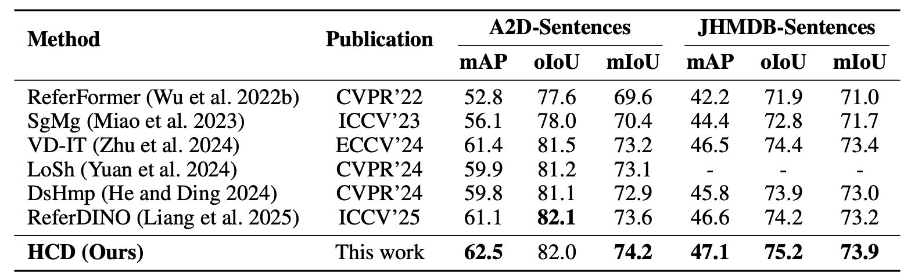

[](https://opensource.org/licenses/Apache-2.0)
[](https://pytorch.org/)

The official implementation of the paper:

<div align="center">
<h1>
<b>
Temporal-Conditional Referring Video Object Segmentation with Noise-Free Text-to-Video Diffusion Model
</b>
</h1>
</div>

<p align="center"></p>

> [**Temporal-Conditional Referring Video Object Segmentation with Noise-Free Text-to-Video Diffusion Model**](https://arxiv.org/abs/2508.13584)
>
> Ruixin Zhang, Jiaqin Fan, Yifan Liao, Qian Qiao, Fanzhang Li
### Abstract
Referring Video Object Segmentation (RVOS) aims to segment specific objects in a video according to textual descriptions. We observe that recent RVOS approaches often place excessive emphasis on feature extraction and temporal modeling, while relatively neglecting the design of the segmentation head. In fact, there remains considerable room for improvement in segmentation head design. To address this, we propose a Temporal-Conditional Referring Video Object Segmentation model, which innovatively integrates existing segmentation methods to effectively enhance boundary segmentation capability. Furthermore, our model leverages a text-to-video diffusion model for feature extraction. On top of this, we remove the traditional noise prediction module to avoid the randomness of noise from degrading segmentation accuracy, thereby simplifying the model while improving performance. Finally, to overcome the limited feature extraction capability of the VAE, we design a Temporal Context Mask Refinement (TCMR) module, which significantly improves segmentation quality without introducing complex designs. We evaluate our method on four public RVOS benchmarks, where it consistently achieves state-of-the-art performance.

### Setup for R-VOS

The main setup for R-VOS of our code follows [Referformer](https://github.com/wjn922/ReferFormer), [SgMg](https://github.com/bo-miao/SgMg), [VD-IT](https://github.com/buxiangzhiren/VD-IT).


First, clone the repository locally.

```
git clone https://github.com/buxiangzhiren/HCD
cd HCD
conda create -n hcd python=3.8
```

Then, install Pytorch, torchvision and the necessary packages as well as pycocotools. You can choose the CUDA version that corresponds to your device.
```
pip install torch==2.4.0 torchvision==0.19.0 torchaudio==2.4.0 --index-url https://download.pytorch.org/whl/cu121
pip install -r requirements.txt
```
download weights
```
pip install huggingface_hub
huggingface-cli download --resume-download ali-vilab/text-to-video-ms-1.7b --local-dir ./weight
huggingface-cli download --resume-download laion/CLIP-ViT-H-14-laion2B-s32B-b79K --local-dir ./weight/clip
huggingface-cli download --resume-download roberta-base --local-dir ./weight/roberta
```

Finally, compile CUDA operators.
```
cd models/ops
python setup.py build install
cd ../..
```

Please refer to [data.md](docs/data.md) for data preparation.

### Training and Evaluation

The training and evaluation scripts are included in the `scripts` folder. Please run the following command:

```
sh ./scripts/dist_train_ytvos_hcd.sh
```

```
sh ./scripts/dist_test_ytvos_hcd.sh
```


### Ref-Youtube-VOS & Ref-DAVIS17
<p align="center"></p>

* denotes that we run the [official codes](https://github.com/bo-miao/SgMg) to get the results.


### A2D-Sentences & JHMDB-Sentences
<p align="center"></p>

## Acknowledgement

This repo is based on [ReferFormer](https://github.com/wjn922/ReferFormer), [VD-IT](https://github.com/buxiangzhiren/VD-IT) and [ModelScopeT2V](https://modelscope.cn/models/damo/text-to-video-synthesis/summary). Thanks for their wonderful works.


## Citation

```
@misc{2508.13584,
Author = {Ruixin Zhang and Jiaqing Fan and Yifan Liao and Qian Qiao and Fanzhang Li},
Title = {Temporal-Conditional Referring Video Object Segmentation with Noise-Free Text-to-Video Diffusion Model},
Year = {2025},
Eprint = {arXiv:2508.13584},
}
```